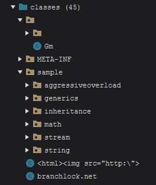
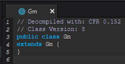
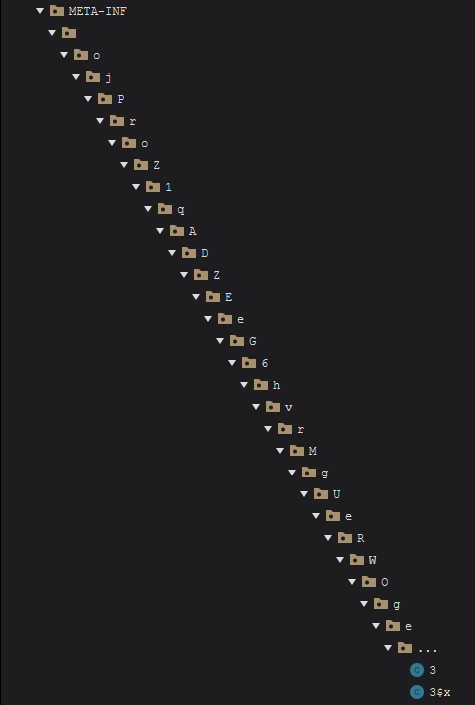
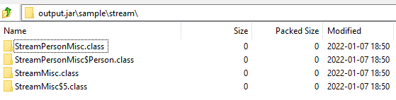

# Branchlock _(3.0.0)_

Branchlock is an online commercial obfuscator. It advertises itself as _"modern, lightweight, but powerful"_.

## Anti-Reversing tricks

### 1: Abusing Java Swing's HTML rendering

Swing UI's are often customized by using HTML elements such as `<b>` and `<span style="color: red">`. Branchlock inserts an `` tag into a class's name _(which is illegal and won't run due to path constraints, but is 'valid' enough for the class file spec to be parsable)_ so that Java reversing tools made with Swing that do not explicitly disable this feature advertise the product.


This does not affect applications that have disabled this feature or use a different UI framework.



### 2. Class inheritance infinite loop



Branchlock dumps an empty class that `extends` itself so that if you run any automated tools that try to create class hierarchies they will get stuck in an infinite loop. AFAIK Recaf is the primary target here since it uses JPhantom to generate missing classes to assist its recompilation feature, and this _used_ to kill Recaf but [has since been patched](https://github.com/Col-E/Recaf/commit/53da1d3adf0e831e89f5f580c1bf4e08d81c9a6c).

### 3. Long path

This occurs in multiple locations. Its a common trick that can make UI based tools choke when they suddenly need to generate 1000's of graphic nodes of directory entries that are effectively useless. Again, [Recaf has addressed this by flattening long paths](https://github.com/Col-E/Recaf/commit/07a4b37d99514a5fab4830583b4fbb810e2d42f9).




### 4. FakeDirectory

This trick abuses an edge case in how the JVM reads classes from zip files vs how most standard ZIP based tools function. You can have a zip data entry path end in a forward slash and the JVM will still check the entry for a class if the name otherwise ends in `.class`

Branchlock applies this to all classes.



### 5. Invalid generic signatures

Signatures are different from descriptors. Descriptors define the concrete type of a field or method. Signatures are optional debug attributes attached to a field or method that describe the generic type of the member. Since it's optional debug info the JVM never actually needs to look at it. Its there merely so the compiler can fulfil type contracts when using generics at compile-time. You can put literal garbage in there. Branchlock does that and this results in most decompilers giving up, because nobody bothers to handle cases of intentional obfuscation aside from CFR.

**FernFlower**

```
java.lang.IllegalArgumentException: Invalid descriptor: (Ljava/lang/String; type = 10; classname = java/lang/Object; elementname = hashCode
	at org.jetbrains.java.decompiler.struct.consts.LinkConstant.initConstant(LinkConstant.java:32)
	at org.jetbrains.java.decompiler.struct.consts.LinkConstant.resolveConstant(LinkConstant.java:61)
	at org.jetbrains.java.decompiler.struct.consts.ConstantPool.<init>(ConstantPool.java:100)
	at org.jetbrains.java.decompiler.struct.StructClass.create(StructClass.java:58)
	at org.jetbrains.java.decompiler.struct.StructContext.addData(StructContext.java:176)
```


**Procyon**

```
java.lang.reflect.GenericSignatureFormatError
	at com.strobel.assembler.metadata.signatures.SignatureParser.error(SignatureParser.java:70)
	at com.strobel.assembler.metadata.signatures.SignatureParser.parseFieldTypeSignature(SignatureParser.java:179)
	at com.strobel.assembler.metadata.signatures.SignatureParser.parseTypeSignature(SignatureParser.java:327)
	at com.strobel.assembler.metadata.signatures.SignatureParser.parseTypeSignature(SignatureParser.java:97)
	at com.strobel.assembler.metadata.MetadataParser.parseTypeSignature(MetadataParser.java:131)
	at com.strobel.assembler.metadata.ClassFileReader$Scope.lookupType(ClassFileReader.java:1227)
	at com.strobel.assembler.ir.AnnotationReader.read(AnnotationReader.java:34)
	at com.strobel.assembler.ir.MetadataReader.readAttributeCore(MetadataReader.java:234)
	at com.strobel.assembler.metadata.ClassFileReader.readAttributeCore(ClassFileReader.java:261)
	at com.strobel.assembler.ir.MetadataReader.inflateAttribute(MetadataReader.java:393)
	at com.strobel.assembler.ir.MetadataReader.inflateAttributes(MetadataReader.java:370)
	at com.strobel.assembler.metadata.ClassFileReader.defineMethods(ClassFileReader.java:978)
	at com.strobel.assembler.metadata.ClassFileReader.readClass(ClassFileReader.java:441)
	at com.strobel.assembler.metadata.ClassFileReader.readClass(ClassFileReader.java:377)
	at com.strobel.assembler.metadata.MetadataSystem.resolveType(MetadataSystem.java:129)
	at com.strobel.assembler.metadata.MetadataSystem.lookupTypeCore(MetadataSystem.java:86)
	at com.strobel.assembler.metadata.MetadataResolver.lookupType(MetadataResolver.java:46)
```

